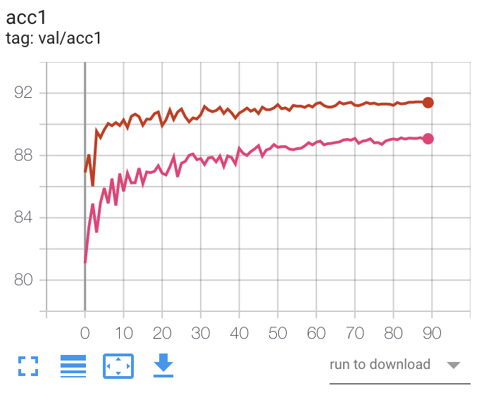

# ADMM level (pecentage) pruner

| Cifar10_VGGsmall | accuracy(convergence) | sparsity | base lr | rho(dynamic) |
|------------------|-----------------------|----------|---------|--------------|
| ADMM_step1       | 91.86(0.79)           | 0.95     | 0.01    | 0.1          |
| ADMM_step2       | 91.39                 | 0.95     | 0.01    | -            |
| Pruner           | 89.07                 | 0.95     | 0.01    | -            |
| ADMM_step1       | 93.75(2.67)           | 0.95     | 0.01    | 0.01         |
| ADMM_step2       | 88.72                 | 0.95     | 0.01    | -            |
| ADMM_step1       | 93.01(0)              | 0.95     | 0.01    | 0.05d        |
| ADMM_step2       | **93.07**             | 0.95     | 0.01    | -            |


red: admm_step2 other: pruner

```bash
# straight pruning
python examples/classifier_cifar10/main_admm.py ~/datasets/data.cifar10 \
    -a cifar10_vggsmall -j 10 -b 128 --pretrained \
    --lr 0.01 --wd 1e-4 --warmup-epoch -1 \
    --gpu $1 --log-name $2 --epochs 90 --lr-scheduler CosineAnnealingLR \
    --debug --sparsity 0.95

# admm step 1
python examples/classifier_cifar10/main_admm.py ~/datasets/data.cifar10 \
    -a cifar10_vggsmall -j 10 -b 128 --pretrained \
    --lr 0.01 --wd 1e-4 --warmup-epoch -1 \
    --gpu $1 --log-name $2 --epochs 90 --lr-scheduler CosineAnnealingLR \
    --debug --admm --sparsity 0.95 --rho 0.1
# admm step 2
python examples/classifier_cifar10/main_admm.py ~/datasets/data.cifar10 \
    -a cifar10_vggsmall -j 10 -b 128 --pretrained \
    --lr 0.01 --wd 1e-4 --warmup-epoch -1 \
    --gpu $1 --log-name $2 --epochs 90 --lr-scheduler CosineAnnealingLR \
    --debug --sparsity 0.95 --resume-after $3
    
# admm step 1
python examples/classifier_cifar10/main_admm.py ~/datasets/data.cifar10 \
    -a cifar10_vggsmall -j 10 -b 128 --pretrained \
    --lr 0.01 --wd 1e-4 --warmup-epoch -1 \
    --gpu $1 --log-name $2 --epochs 90 --lr-scheduler CosineAnnealingLR \
    --debug --admm --sparsity 0.95 --rho 0.05 --rho-dynamic
# admm step 2
python examples/classifier_cifar10/main_admm.py ~/datasets/data.cifar10 \
    -a cifar10_vggsmall -j 10 -b 128 --pretrained \
    --lr 0.001 --wd 1e-4 --warmup-epoch -1 \
    --gpu $1 --log-name $2 --epochs 5 --lr-scheduler CosineAnnealingLR \
    --debug --sparsity 0.95 --resume-after $3
```
