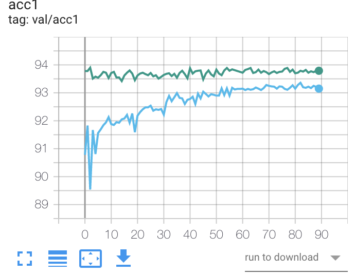
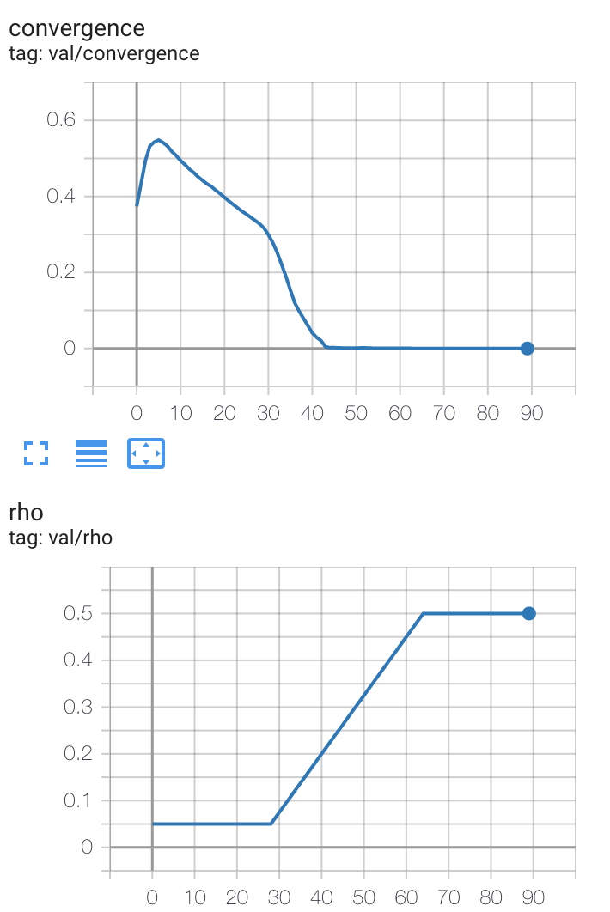

# ADMM NPU-structured pruner

| Cifar10_VGGsmall | accuracy(convergence) | non-zero-num | base lr | rho (dynamic)  |
|------------------|-----------------------|--------------|---------|----------------|
| ADMM_step1       | 93.94(0.03)           | 7/32         | 0.01    | 0.05           |
| ADMM_step2       | 93.9                  | 7/32         | 0.01    | -              |
| Pruner           | 93.36                 | 7/32         | 0.01    | -              |
| Pruner INS       | 93.21                 | 7/32         | 0.01    | -              |
| ADMM_step1       | 93.94(0)              | 7/32         | 0.01    | d0.05          |
| ADMM_step2       | **94.17**             | 7/32         | 0.001   | -              |




```bash
# straight npu pruning
python examples/classifier_cifar10/main_admm_npu.py ~/datasets/data.cifar10 \
    -a cifar10_vggsmall -j 10 -b 128 --pretrained \
    --lr 0.01 --wd 1e-4 --warmup-epoch -1 \
    --gpu $1 --log-name $2 --epochs 90 --lr-scheduler CosineAnnealingLR \
    --debug --non-zero-num 7
# INS npu pruning
python examples/classifier_cifar10/main_admm_npu.py ~/datasets/data.cifar10 \
    -a cifar10_vggsmall -j 10 -b 128 --pretrained \
    --lr 0.01 --wd 1e-4 --warmup-epoch -1 \
    --gpu $1 --log-name $2 --epochs 90 --lr-scheduler CosineAnnealingLR \
    --debug --non-zero-num 7 --INS --beta 0.1

# admm step 1 npu pruning
python examples/classifier_cifar10/main_admm_npu.py ~/datasets/data.cifar10 \
    -a cifar10_vggsmall -j 10 -b 128 --pretrained \
    --lr 0.01 --wd 1e-4 --warmup-epoch -1 \
    --gpu $1 --log-name $2 --epochs 90 --lr-scheduler CosineAnnealingLR \
    --debug --admm --non-zero-num 7 --rho 0.05 --rho-dynamic
# admm step 2 npu pruning
python examples/classifier_cifar10/main_admm_npu.py ~/datasets/data.cifar10 \
    -a cifar10_vggsmall -j 10 -b 128 --pretrained \
    --lr 0.001 --wd 1e-4 --warmup-epoch -1 \
    --gpu $1 --log-name $2 --epochs 10 --lr-scheduler CosineAnnealingLR \
    --debug --non-zero-num 7 --resume-after $3
```
| ImageNet_ResNet18 | accuracy(convergence)  | non-zero-num | base lr | rho(dynamic) | log_name                             |
|-------------------|------------------------|--------------|---------|--------------|--------------------------------------|
| Pruner(INS)       | **68.83**              | 7/32         | 0.001   | -            | resnet18_npu_2ins7                   |
| Pruner            | 61                     | 7/32         | 0.01    | -            | resnet18_npu_7_straight              |
| ADMM_step1        | 70.55(0.98)            | 7/32         | 0.001   | 0.01         | resnet18_npu_7_admm_step1            |
| ADMM_step2        | 59.66                  | 7/32         | 0.001   | -            | resnet18_npu_7_admm_step2            |
| ADMM_step1        | 69.94(0.49)            | 7/32         | 0.001   | 0.05         | resnet18_npu_7_admm_rho0.05_step1    |
| ADMM_step2        | 64.57                  | 7/32         | 0.001   | -            | resnet18_npu_7_admm_rho0.05_step2    |
| ADMM_step1        | 67.37(1e-4)            | 7/32         | 0.01    | 0.1          | resnet18_npu_7_admm_rho0.1_step1     |
| ADMM_step2        | 67.45                  | 7/32         | 0.01    | -            | resnet18_npu_7_admm_rho0.1_step2_ttt |
| ADMM_step1        | 68.19(0)               | 7/32         | 0.01    | d0.05        | resnet18_npu_7_admm_drho0.05_step1   |
| ADMM_step2        | 68.19 improved         | 7/32         | 0.001   | -            | resnet18_npu_7_admm_drho0.05_step2   |
| ADMM_step1        | 69.98(0.48)            | 7/32         | 0.001   | d0.01        |                                      |
|                   | -                      |              |         |              |                                      |
| ADMM_step1        | **67.1(0.03)** 57epoch | 7/32         | 0.01    | d0.01        | resnet18_npu_7_admm_drho0.01_step1   |
|                   | waiting                |              |         |              |                                      |

```bash
# NPU 7 ADMM step 1
python examples/classifier_imagenet/main_npu.py ~/datasets/data.imagenet \
    -a resnet18 -j 10 -b 512 --pretrained \
    --lr 0.001 --wd 1e-4 --warmup-epoch -1 \
    --gpu $1 --log-name $2 --epochs 90 --lr-scheduler CosineAnnealingLR \
    --debug --non-zero-num 7 --admm --rho 0.01 --rho-dynamic
# NPU 7 ADMM step 2
python examples/classifier_imagenet/main_npu.py ~/datasets/data.imagenet \
    -a resnet18 -j 10 -b 512 --pretrained \
    --lr 0.001 --wd 1e-4 --warmup-epoch -1 \
    --gpu $1 --log-name $2 --epochs 40 --lr-scheduler CosineAnnealingLR \
    --debug --non-zero-num 7 --resume-after $3
```
