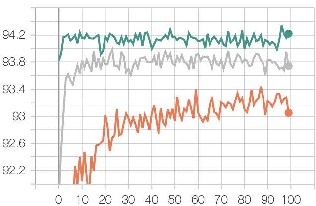
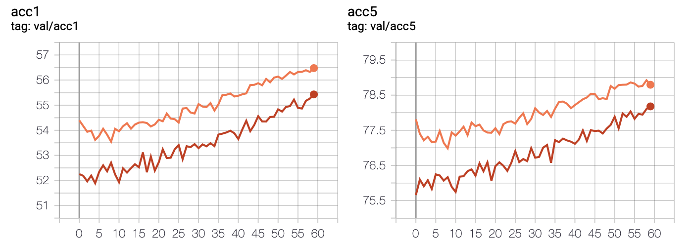
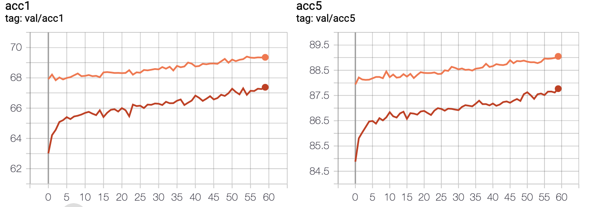

# Code for LLSQ

## VGGSmall 93.34

```bash
python examples/classifier_cifar10/main.py ~/datasets/data.cifar10 \
    -a cifar10_vggsmall_llsq --gen-map --original-model cifar10_vggsmall
```

```bash
python examples/classifier_cifar10/main.py ~/datasets/data.cifar10 \
    -a cifar10_vggsmall_llsq -j 10 -b 256 --pretrained \
    --gpu $1 --log-name $2 --lr 0.0002 --epochs 100 --cosine \
    --qw 4 --qa 4 --q-mode kernel_wise --debug
# 94.28 (每次跑出来的结果都略有不同)

python examples/classifier_cifar10/main.py ~/datasets/data.cifar10 \
    -a cifar10_vggsmall_llsq -j 10 -b 256 --pretrained \
    --gpu $1 --log-name $2 --lr 0.0002 --epochs 100 --cosine \
    --qw 3 --qa 3 --q-mode kernel_wise --debug
# 93.98

python examples/classifier_cifar10/main.py ~/datasets/data.cifar10 \
    -a cifar10_vggsmall_llsq -j 10 -b 256 --pretrained \
    --gpu $1 --log-name $2 --lr 0.0002 --epochs 100 --cosine \
    --qw 2 --qa 2 --q-mode kernel_wise --debug
# 93.44
```


## AlexNet Acc@1 56.518 Acc@5 79.070

```bash
python examples/classifier_imagenet/main.py ~/datasets/data.imagenet \
    -a alexnet_llsq --gen-map --original-model alexnet
```
```bash
python examples/classifier_imagenet/main.py ~/datasets/data.imagenet \
    -a alexnet_llsq -j 10 --pretrained -b 128 --log-name $2 \
    --lr 2e-4 --wd 1e-4 --warmup-multiplier 2.5 --warmup-epoch 2 \
    --gpu $1 --epochs 60 --cosine --qw 4 --qa 4 --debug
# 56.48 78.80
```
```bash
python examples/classifier_imagenet/main.py ~/datasets/data.imagenet \
    -a alexnet_llsq -j 10 --pretrained -b 128 --log-name $2 \
    --lr 2e-4 --wd 1e-4 --warmup-multiplier 2.5 --warmup-epoch 2 \
    --gpu $1 --epochs 60 --cosine --qw 3 --qa 3 --debug
# 55.43 78.18
```


## ResNet18 Acc@1 69.758 Acc@5 89.078
```bash
python examples/classifier_imagenet/main.py ~/datasets/data.imagenet \
    -a resnet18_llsq --gen-map --original-model resnet18
```
```bash
python examples/classifier_imagenet/main.py ~/datasets/data.imagenet \
    -a resnet18_llsq -j 10 --pretrained -b 128 --log-name $2 \
    --lr 2e-4 --wd 1e-4 --warmup-multiplier 2.5 --warmup-epoch 2 \
    --gpu $1 --epochs 60 --cosine --qw 4 --qa 4 --debug
# 69.4 88.83
```
```bash
python examples/classifier_imagenet/main.py ~/datasets/data.imagenet \
    -a resnet18_llsq -j 10 --pretrained -b 128 --log-name $2 \
    --lr 2e-4 --wd 1e-4 --warmup-multiplier 2.5 --warmup-epoch 2 \
    --gpu $1 --epochs 60 --cosine --qw 3 --qa 3 --debug
# 67.38 87.77
```

